=================
Guide to use tbot
=================

This is a small guide of how to use tbot when starting from scratch.

When reading this section, you get a step by step introduction how to use tbot with a beagleboneblack and a
"Gembird Silver Shield PM power controller" and using kermit for accessing the serial console.

tbot installation
=================

Buy the following hw
--------------------

[1] Beagle Bone Black
    http://beagleboard.org/black

[2] Gembird Silver Shield PM power controller
    https://www.amazon.de/EG-PMS2-programmierbare-Steckdosenleiste-%C3%9Cberspannungsschutz-Schnittstelle/dp/B00BAQZJ4K/ref=sr_1_3?ie=UTF8&qid=1502686146&sr=8-3&keywords=SIS-PMS+Silvershield+Power+Manager

[3] USB2serial FTDI
    http://elinux.org/Beagleboard:BeagleBone_Black_Accessories#Serial_Debug_Cables

If you want to switch bootmodes, buy an USB relais

[4] USB Relais
    https://www.sainsmart.com/sainsmart-4-channel-5v-usb-relay-board-module-controller-for-automation-robotics.html

    be sure you get the 5V one, not as I the 12V one. With the 12V one you need
    12V external power ...

Remark: you do not need to use/buy this specific hw, for getting tbot running, but it is used in this example.

[5] Lap and Host PC
    Of course you need a PC with a linux installation.
    I use/used fedora 21, 22, 24, and 25, but all other distros should work too.

For this guide we use first the PC [5] as Host and LapPC.

Later, you can install tbot on another PC and use [5] as LapPC
only.

install paramiko on [5]
-----------------------

you need for running tbot the python paramiko module, see:

http://www.paramiko.org/installing.html

install gembird software
------------------------

http://sispmctl.sourceforge.net/

install kermit
--------------

use a package manager for this job, or download source from here:

http://www.columbia.edu/kermit/ckuins.html

get the tbot source code:
-------------------------

::

  $ git clone https://github.com/hsdenx/tbot.git
  [...]
  $

cd into the tbot directory.

try ssh access to your LabPC
----------------------------

first we test, if we can ssh to our PC [5]. As we use [5] as Host and LabPC
this should work, but we test it. Find out the ip or host name of your machine
and ssh to it, for me this looked like:

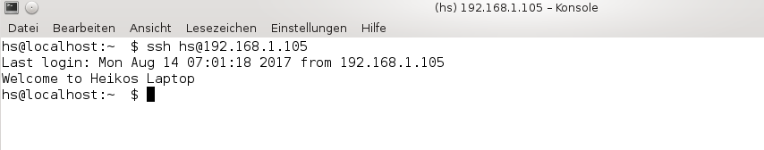

copy some existing lab config to your new config
------------------------------------------------

::

  hs@localhost:tbot  [master] $ cp config/lab_hs_home.py config/lab_hs_laptop.py
  hs@localhost:tbot  [master] $

You can name your new lab config as you want, but I prefer to let it
begin with prefix `lab_`. In the following guide I use for the lab config
the name "lab_hs_laptop" ... please replace this with the name you
defined here!

Adapt the setting for accessing your labPC
------------------------------------------

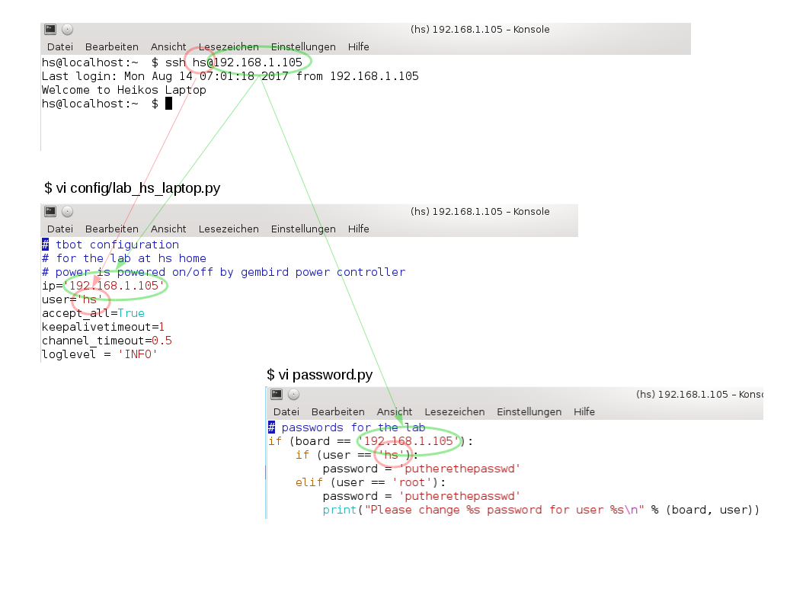

If you need a password for ssh to your PC than add it in
the password.py file

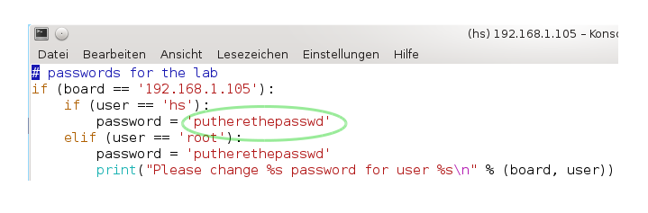

If you need a public key, than add it in your password.py

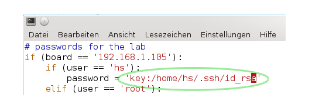

If you need to adapt the portnumber for ssh

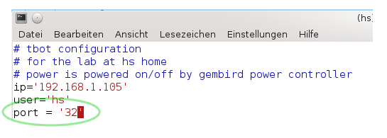

Adapt settings for Gembird Powercontroller
------------------------------------------

connect your USB cable from the Gembirs Powercontroller with an USB port on your PC.

check, if your laptop detected the Powercontroller, with dmesg output.

You should see something like that

::

  [ 2475.394934] usb 1-4: new low-speed USB device number 6 using xhci_hcd
  [ 2475.564195] usb 1-4: New USB device found, idVendor=04b4, idProduct=fd13
  [ 2475.564200] usb 1-4: New USB device strings: Mfr=1, Product=2, SerialNumber=0
  [ 2475.564202] usb 1-4: Product: Gembird Silver Shield PM
  [ 2475.564204] usb 1-4: Manufacturer: Gembird Electronics
  [ 2475.565613] usbhid 1-4:1.0: couldn't find an input interrupt endpoint
  hs@localhost:tbot  [master] $ 

Now, check if the "sispmctl" tool work with your Gembird Powercontroller.

Check version of sispmctl tool

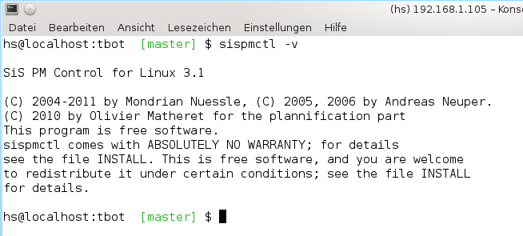

Scan for the Powercontroller

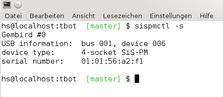

Now adapt the tbot settings for your needs:

.. image:: image/guide/guide_sispmctl_explanation.png

This is the setup for powering port 1 on/off of the Gembird controller.

If you need to use another port of the Gembird controller, change the
value in "tb.config.gembird_index" to the appropriate value.

Now it should be possible to switch on/off port 1 on the Gembird
Powercontroller with tbot.

If you can;t wait and want to test this now, we need to supress
tbot to connect to the boards console, as we did not have setup
it up yet:

So add in config/lab_hs_laptop.py the line

::

  do_connect_to_board = False

and start tbot:

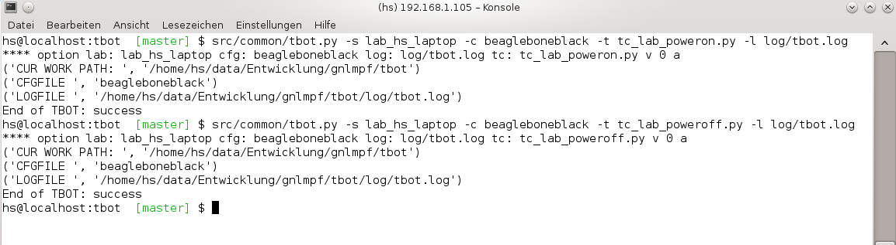

You should see on the Gembird controller the respective port going
on and off.

Now, we want to setup the console, so remove the line

::

  do_connect_to_board = False

in "config/lab_hs_laptop.py"

Setup the console
-----------------

attach the USB2serial [3] cable to your USB port on [5]

check dmesg output:

::

  [ 7554.706870] usb 1-3: new full-speed USB device number 7 using xhci_hcd
  [ 7554.871691] usb 1-3: New USB device found, idVendor=067b, idProduct=2303
  [ 7554.871696] usb 1-3: New USB device strings: Mfr=1, Product=2, SerialNumber=0
  [ 7554.871698] usb 1-3: Product: USB-Serial Controller
  [ 7554.871700] usb 1-3: Manufacturer: Prolific Technology Inc.
  [ 7556.354720] usbcore: registered new interface driver pl2303
  [ 7556.354741] usbserial: USB Serial support registered for pl2303
  [ 7556.354763] pl2303 1-3:1.0: pl2303 converter detected
  [ 7556.355611] usb 1-3: pl2303 converter now attached to ttyUSB0
  hs@localhost:tbot  [master] $ 

In our case the USB cable is on /dev/ttyUSB0, so add this value in
"config/lab_hs_laptop.py"

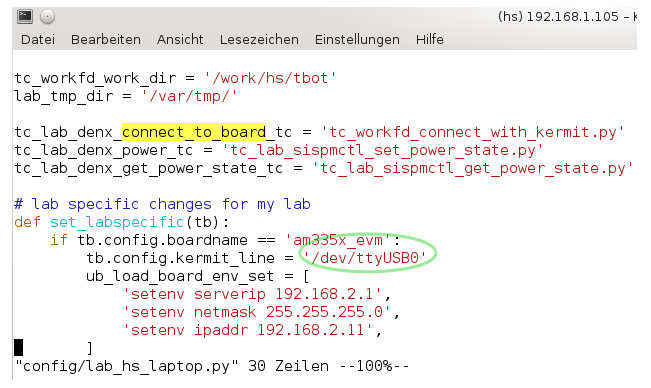

Be sure you have installed kermit and have the correct access rights
to access the serial port!

You can test this with:

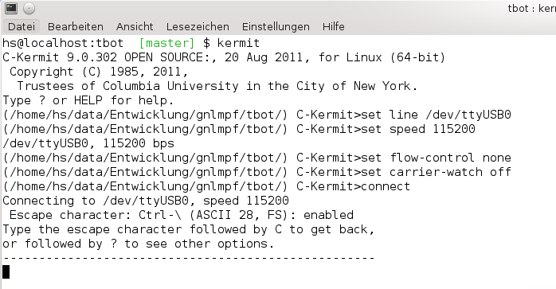

power on the beaglebone and you should see some output from the beagleboneblack.

Put in the powerplug from the beaglebone in the port 1 of your Gembird Powercontroller
(or the port you defined in step `Adapt settings for Gembird Powercontroller`_.

Try a first small U-Boot testcase. Simply set an U-Boots Environment variable.

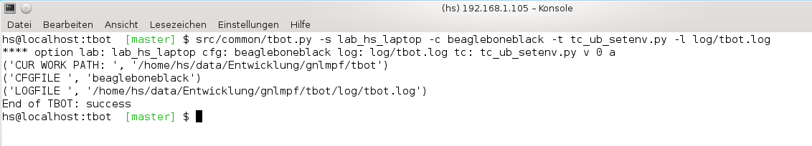

If you want to see, what tbot is doing, enable the verbose "-v" option from tbot.
See also hint `more readable verbose output`_.

Also you can look into the logfile log/tbot.log (filename passed with tbots option "-l")

If you get "set board state failure end" message

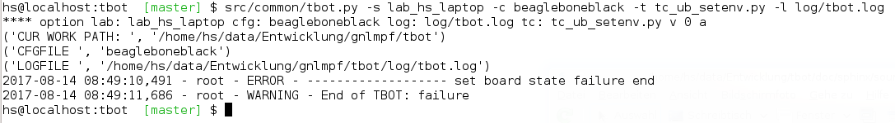

May you have a Beagleboneblack board with a very old U-Boot.

U-Boots prompt changes once from "U-Boot# " to "=> ".

The default value is the new "=> " one ... so, edit the board config
"config/beagleboneblack.py" as follow:

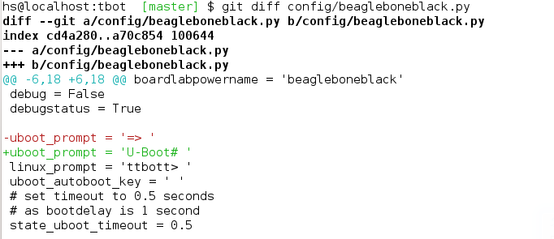

Now you can start with writting testcases for the beagleboneblack board,
see `tbot write a testcase`_.

tbot install statistic backend
------------------------------

install gnuplot on your labPC [5]. Installation see

http://www.gnuplot.info/

Used version in for this guide:

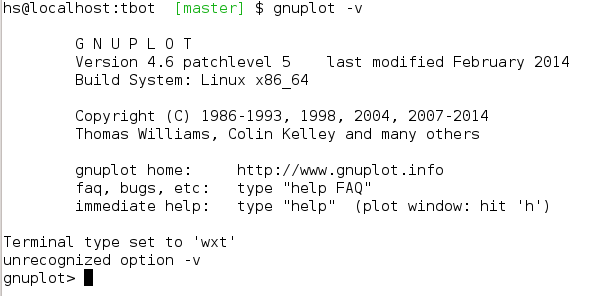

Enable the statistic backend in tbot

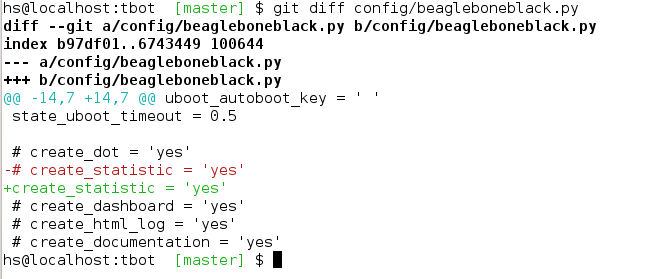

run tbot and after tbot finsihed you got in tbot source dir the file
"stat.dat". Simply call now gnuplot:

::

  hs@localhost:tbot  [master] $ gnuplot src/files/balkenplot.sem
  hs@localhost:tbot  [master] $

and find the output.jpg in tbot source dir.

tbot install dot backend
------------------------

install dot on your labPC [5]. Installation see

http://www.graphviz.org/Download..php

Used version in for this guide:

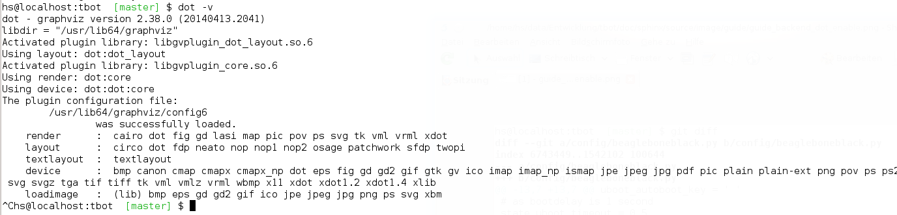

Enable the dot backend in tbot

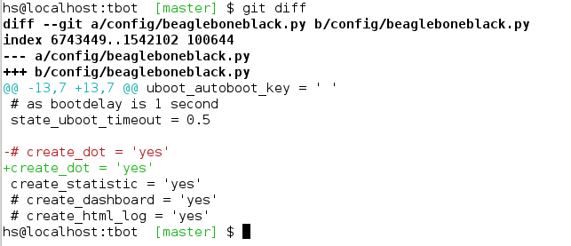

Simply run now tbot and after tbot finshed you see the file
"tc.dot" in tbot source directory.

Create a png Image with

::

   $ dot -Tpng tc.dot > tc.png

or a ps file with

::

  $ dot -Tps tc.dot > tc.ps

tbot install html backend
-------------------------

Enable the html backend in tbot

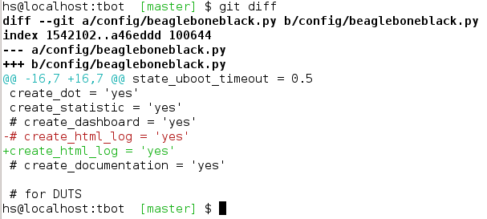

start tbot and at the end, you have the new file "log/html_log.html"

Simply open this html file with a broswer, and you should see the "nice log".

! The html file needs the css style sheet file "log/multiplexed_tbotlog.css" file

tbot install dashboard
----------------------

Enable dashboard for the bbb:

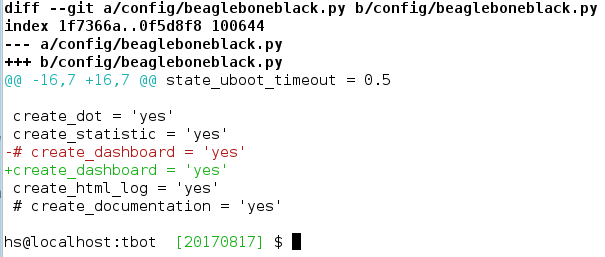

create in database tbot_root a table for tbot with

::

  $ mysql tbot_root -u tbot -p  < src/files/mysql/tbot_root.sql
  Enter password: 
  $

If you want to use another name for the database, replace "tbot_root"
with the name you use. In this case, also edit

https://github.com/hsdenx/tbot/blob/master/src/common/tbot_event.py

the line:

::

  self.dashboard = dashboard(self.tb, 'localhost', 'tbot', 'tbot', 'tbot_root', 'tbot_results')

replace "tbot_root" with the name you use. Also, if you have other user / password
settings adapt them in this line.

Now you should see after tbot finished a new entry in your database.

A simple php script, which you can open in a webbroser:

https://github.com/hsdenx/tbot/blob/master/src/dashboard/read_db.php

edit your database settings in the file:

https://github.com/hsdenx/tbot/blob/master/src/dashboard/konfiguration.php

The dashboard event backend expect the webservers root dir in

"/var/www/html"

If this is not the case for you, edit

https://github.com/hsdenx/tbot/blob/master/src/common/event/dashboard.py

the variable "self.webdir" (and send a patch, which makes this configurable)

Copy the read_db.php and konfiguration.php script into your webservers
root dir (the setting from self.webdir)

tbot guide backend ToDo
-----------------------

- guide for setting up event backends

  - documentation

tbot compile, install U-Boot on the bbb
---------------------------------------

This section describes, what you must do, for setting up to start testcase:

https://github.com/hsdenx/tbot/blob/master/src/tc/demo/tc_demo_part1.py

which does:

- get current mainline u-boot code
- configure, compile it for the bbb
- install the resulting binary on the bbb
- do a small u-boot help command test

prerequisite:

- git must be installed on your LabPC
- you need an installed cross toolchain on your LabPC
- running tftp server on your LabPC

setup working directory for tbot on the LabPC:

edit in config/lab_hs_laptop.py

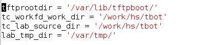

I hope the names are self explaining. Simple set here, which
directories tbot uses on your LabPC.

Edit in this file also the settings for your tftp server and
the ip config in U-Boot for your beagleboneblack:

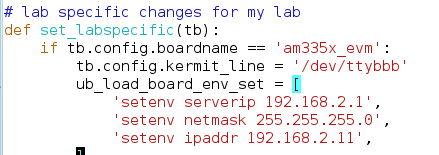

set the toolchain you want to use for compiling U-Boot.

Edit config/beagleboneblack.py

.. image:: image/guide/guide_demo1_toolchain.png

create in your tftpdirectory a subdirectory "beagleboneblack/tbot"

copy the U-Boot Environment file from 

https://github.com/hsdenx/tbot/blob/master/src/files/uboot_env/beagleboneblack.env

into your tftp directory "beagleboneblack/tbot". May you need to adapt
the values mlofile and ubfile:

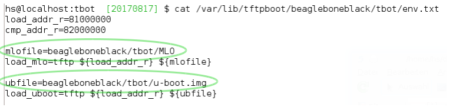

tbot copies the results from the build into it. After a successfull
tbot run, this looks for me:

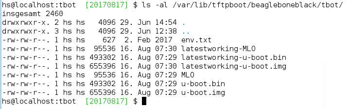

Now you are ready to start tbot:

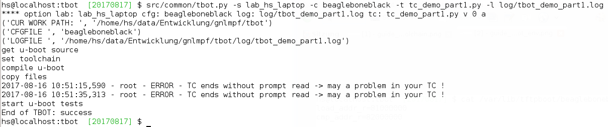

You see the status output, which is default enabled for the
beagleboneblack. If you do not want to see this messages you
can disable them in the file config/beagleboneblack.py

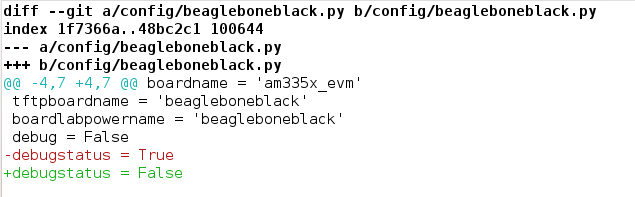

The messages "ERROR - TC ends without prompt read" you can ignore,
as we issue 2 times a reset to the board. If I find time, I fix this.

tbot switch bootmodes on the beagleboneblack
--------------------------------------------

Buy a relay, for this guide I use [4]

connect the USB relay to your LabPC and check dmesg

::

  [18797.469787] usb 1-4.3: new full-speed USB device number 12 using xhci_hcd
  [18797.549695] usb 1-4.3: New USB device found, idVendor=0403, idProduct=6001
  [18797.549700] usb 1-4.3: New USB device strings: Mfr=1, Product=2, SerialNumber=3
  [18797.549703] usb 1-4.3: Product: FT245R USB FIFO
  [18797.549705] usb 1-4.3: Manufacturer: FTDI
  [18797.549707] usb 1-4.3: SerialNumber: AI0537VO
  [18798.736452] usbcore: registered new interface driver ftdi_sio
  [18798.736501] usbserial: USB Serial support registered for FTDI USB Serial Device
  [18798.736622] ftdi_sio 1-4.3:1.0: FTDI USB Serial Device converter detected
  [18798.736722] usb 1-4.3: Detected FT232RL
  [18798.738260] usb 1-4.3: FTDI USB Serial Device converter now attached to ttyUSB1
  hs@localhost:tbot  [master] $

install drivers:

Ok, this relay is very bad. It comes with no documentation at all :-(

First I had to install pyusb:

https://github.com/walac/pyusb

than the pyrelayctl tool from

https://github.com/xypron/pyrelayctl/tree/master

and I can access the relay

list all usb relay devices

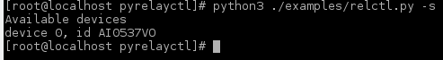

switch usb relay off

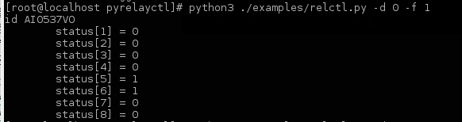

switch usb relay on

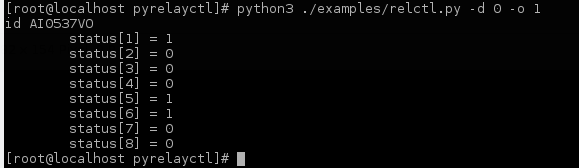

but this does works only with python3
for some reasons on my laptop this will not work ... :-(

Also, there is a jumper on the board, but not connected when I got my relay card.
After attaching a cable

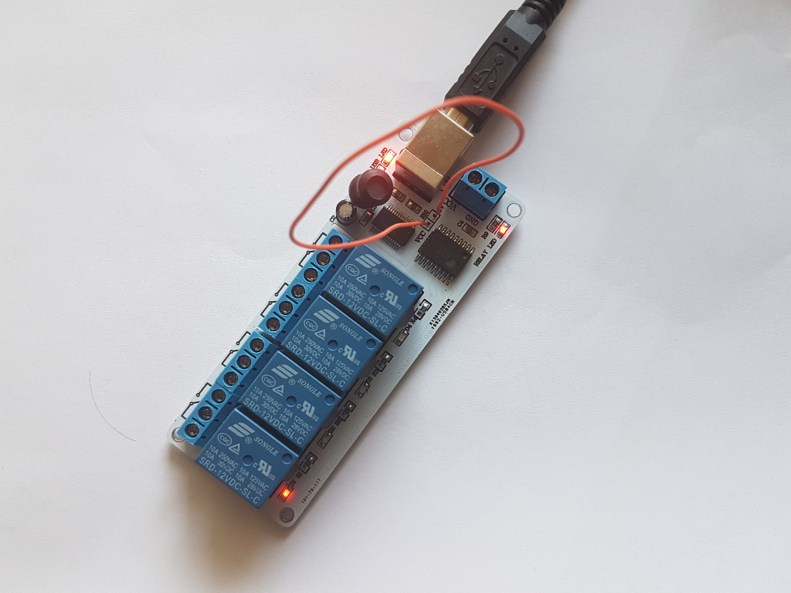

the LED is now working, which indicates the state of the
relays ... I can see the led going on/off when issuing the
cmd, but the relays is not really working ... damn ...

Okay, after one more frustrating day, I found the issue ... I have the 12V
one, not the 5V one ... the relays on my board need an external 12V power unit.

After connecting such a 12V power unit it works :-D

Ok, as python3 does not really work on my laptop, try libftdi:

You find my (not very nice) source code for using this relay under linux

https://github.com/hsdenx/tbot/blob/master/src/files/relay/simple.c

This needs libftdi installed:
http://www.ftdichip.com/Drivers/D2XX.htm

and the simple.c code is based on the examples which comes with libftdi.

compile it with:

::

  $ gcc -o simple simple.c -L. -lftd2xx -Wl,-rpath /usr/local/lib
  $

usage:

./simple [state] [mask]

I connected the bootmode selection pins from the bbb to port 1 of the usb relay

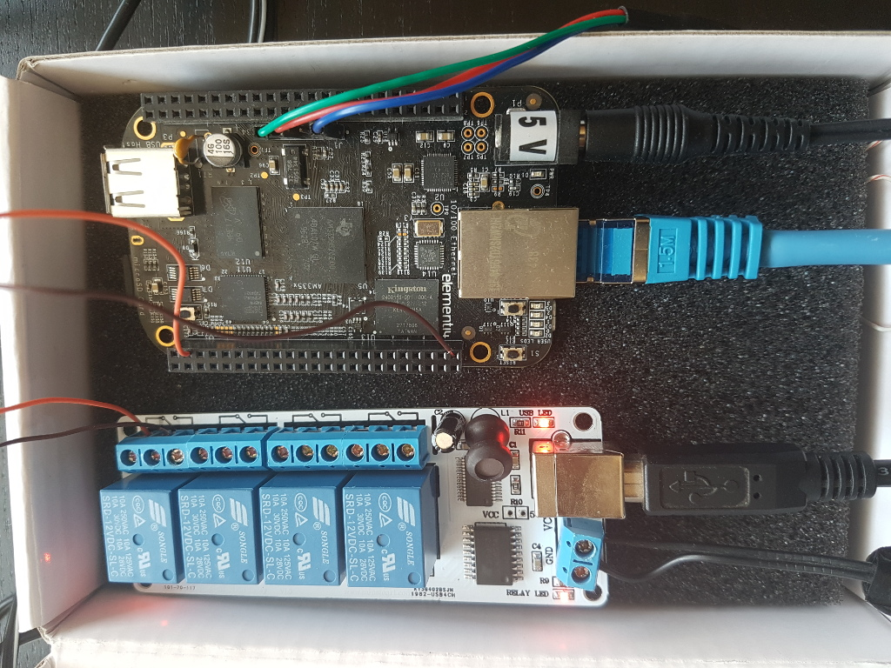

Now testing the bootmode with

USB relay off -> boot from internal emmc

::

  [root@localhost simple]# /home/hs/Software/usbrelais/src/simple 0 15
  Device 0 Serial Number - AI0537VO
  state: 0 mask: 15
  [root@localhost simple]#

USB relay on -> boot from SD card

::

  [root@localhost simple]# /home/hs/Software/usbrelais/src/simple 1 15
  Device 0 Serial Number - AI0537VO
  state: 1 mask: 15
  [root@localhost simple]#

Now we can try this with the 

https://github.com/hsdenx/tbot/blob/master/src/tc/linux/relay/tc_linux_relay_set.py

testcase. You need to setup your specific relay settings in

https://github.com/hsdenx/tbot/blob/master/src/tc/linux/relay/tc_linux_relay_get_config.py

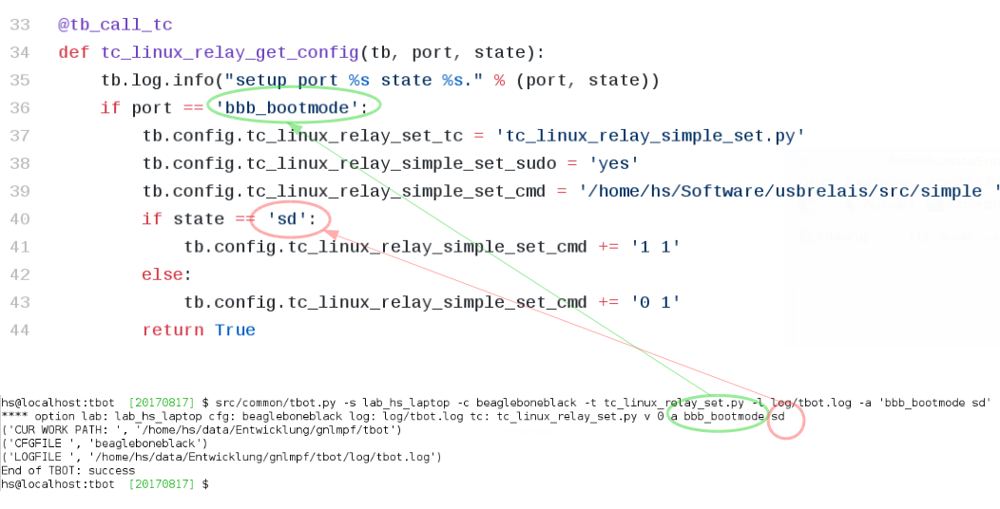

input is state/port, so all your usb relays you use in your vlab, must
have unique port strings! No problem, as you can define them in this file.

In my setting above, I have connected port 1, so I can switch port state
with tbot:

SD

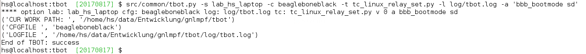

emmc

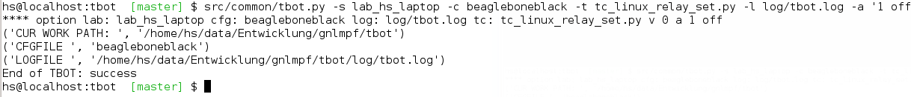

On the console you should see how U-Boot boots from different boot media.

tbot write a testcase
=====================

ToDo

- copy a already existing one
- modify it for your needs

tbot function name glossar
--------------------------

eof_= exit on failure

end tbot when the function ends False. So you save
a lot of

::

  if ret = False:
      tb.end_tc(False)

constructs
              
rup_= read until prompt

This functions reads until prompt. You do not need to
wait for a prompt after this function finished.

tbot Tips/Tricks/Hints
======================

more readable verbose output
----------------------------

tbot prints as fast the incoming characters in verbose mode as possible.

This leads in more or less unreadable verbose output, if you want to
follow what tbot does ... So add the following patch:

::

  hs@localhost:tbot  [master] $ git diff
  diff --git a/src/common/tbot_connection_paramiko.py b/src/common/tbot_connection_paramiko.py
  index b5bdd33..423d8f6 100644
  --- a/src/common/tbot_connection_paramiko.py
  +++ b/src/common/tbot_connection_paramiko.py
  @@ -7,6 +7,7 @@ import logging
   import paramiko
   import socket
   import traceback
  +from time import sleep
   
   class Connection(object):
     """ The connection class
  @@ -83,6 +84,7 @@ class Connection(object):
           """ get bytes from connection
           """
           try:
  +            sleep(0.2)
               tmp = self.channel.recv(self.maxread)
           except socket.timeout:
               logging.debug("read_bytes: Timeout")
  hs@localhost:tbot  [master] $

!! This slows down tbot !! Do not use it in "normal" test environment.

usb serial adapter fix device names
-----------------------------------

If you have more than one serial adapter you have the problem, that the
ttyUSB* device names change from boot to boot ...

To solve this problem use a udev rule.

Check the Vendor/Product ID with lsusb:

::

  [root@localhost]# lsusb
  Bus 003 Device 002: ID 8087:8000 Intel Corp. 
  Bus 003 Device 001: ID 1d6b:0002 Linux Foundation 2.0 root hub
  Bus 002 Device 001: ID 1d6b:0003 Linux Foundation 3.0 root hub
  Bus 001 Device 004: ID 1bcf:2c6e Sunplus Innovation Technology Inc. 
  Bus 001 Device 005: ID 0489:e078 Foxconn / Hon Hai 
  Bus 001 Device 014: ID 0403:6001 Future Technology Devices International, Ltd FT232 USB-Serial (UART) IC
  Bus 001 Device 009: ID 04b4:fd13 Cypress Semiconductor Corp. Programmable power socket
  Bus 001 Device 015: ID 067b:2303 Prolific Technology, Inc. PL2303 Serial Port
  Bus 001 Device 007: ID 05e3:0610 Genesys Logic, Inc. 4-port hub
  Bus 001 Device 006: ID 046d:c52b Logitech, Inc. Unifying Receiver
  Bus 001 Device 001: ID 1d6b:0002 Linux Foundation 2.0 root hub
  [root@localhost]# 

The serial adapter in my system has the Vendor/Product ID "067b:2303".

For distingushing between more than one adapter, we need an unique number
for each adapter ... hopefully your adapters have such a number, in my
example I use the serial number.

read the number for each /dev/ttyUSB* device with the help of the udevadm cmd:

::

  [root@localhost]# udevadm info -a -n /dev/ttyUSB1 | grep '{serial}' | head -n1
      ATTRS{serial}=="A6008isP"
  [root@localhost]# 

Now we can create an udev rules for it, so each serial dapter can get his
own device.

create a "/etc/udev/rules.d/99-usb-serial.rules" and put the follwoing line there:

::

  SUBSYSTEM=="tty", ATTRS{idVendor}=="067b", ATTRS{idProduct}=="2303", ATTRS{serial}=="A6008isP", SYMLINK+="ttybbb"

Test the new rule with

::

  $ udevadm test $(udevadm info -q path -n /dev/ttyUSB1) 2>&1

You should see now a new device "/dev/ttybbb" ...

More to udev rules:

https://wiki.archlinux.org/index.php/udev

