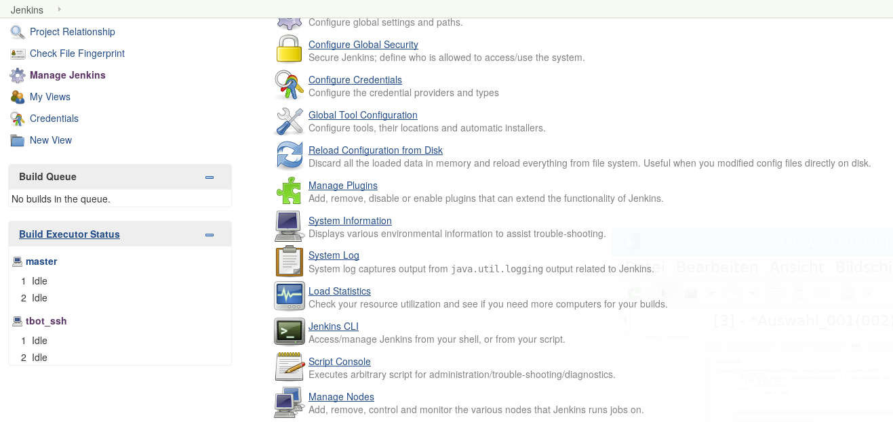
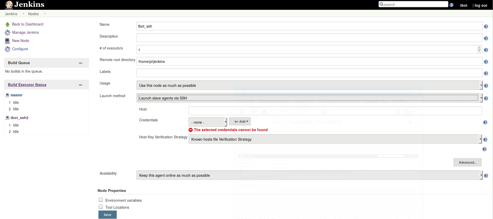
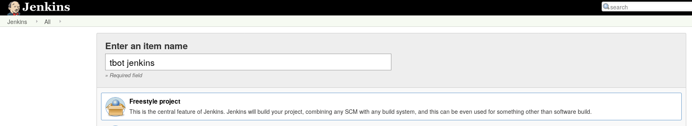
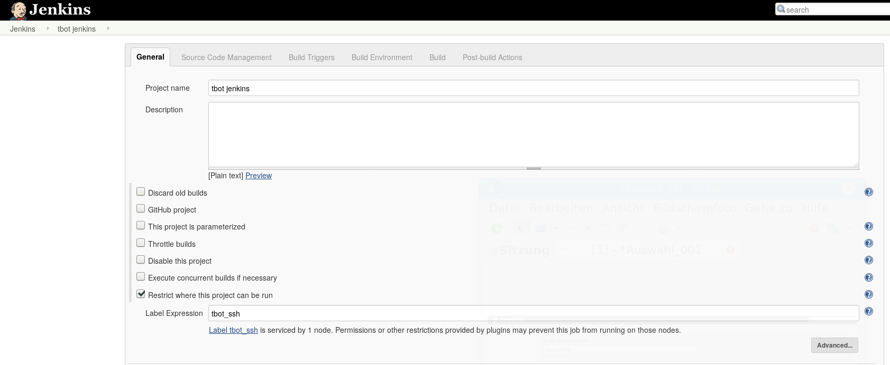
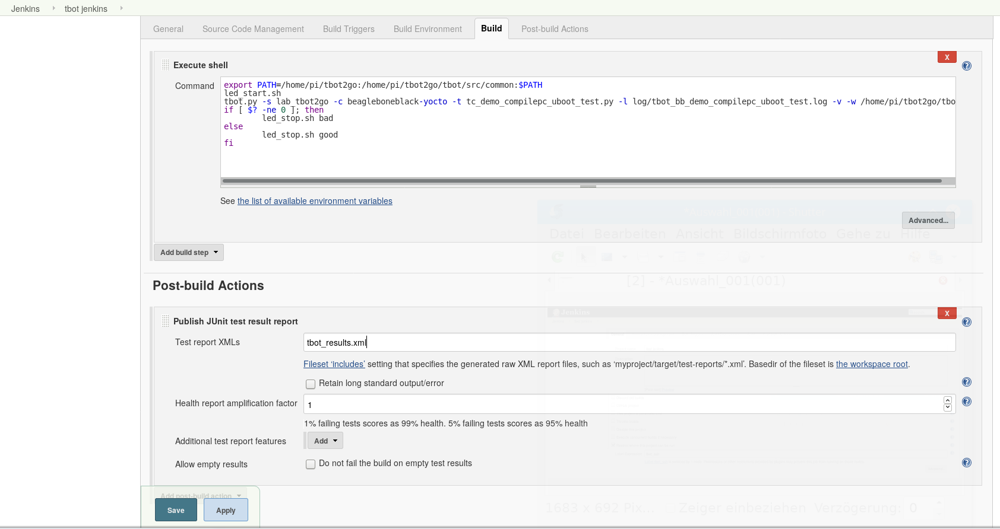

=======================
Setup jenkins with tbot
=======================

This section should explain you, how to use tbot with
jenkins.

You should hava a running tbot, which you can call
from jenkins.

This guide does not explain how to install jenkins, use
google for this purpose.

junit tbot backend
==================

tbots junit backend generates the tbot_results.xml file, which
gives back the results from a tbot run to jenkins.

Activate this tbot backend through config file:

::

  create_junit = 'yes'

This tbot backend needs:

python module
-------------

junit-xml

install with

::

  pip install junit-xml

jenkins plugins
---------------

execute shell script with another user (not jenkins):

setup a ssh agent, which connects you to the machine
which runs tbot (You also need this, if jenkins
is running on the same machine and you run tbot under
another user than jenkins)

storing ssh credentials (for connecting to tbot machine)

https://plugins.jenkins.io/ssh-credentials

storing attachments in jenkins (results from tbot backends)

https://wiki.jenkins.io/display/JENKINS/JUnit+Attachments+Plugin

operation
=========

resulting xml file is stored from tbot into jenkins workspace
refered through jenkins Environment variable:

'$WORKSPACE'

files resulting from tbot backens are stored into

'$WORKSPACE/' + self.testclass + '/'

make sure, jenkins set the environment variable $WORKSPACE !

Running Jenkins behind Apache
=============================

follow the instructions on:

https://wiki.jenkins.io/display/JENKINS/Running+Jenkins+behind+Apache

This is used on the tbot2go setup, where jenkins and tbot
running on a raspberry pi, while you can access jenkins
webinterface through "localhost:8080/jenkins" on a webbrowser
running on the raspberry pi or through apache2 from outside
with for example "ip/jenkins".

Create a new jenkins node (Build Executor)
==========================================

The Build executor is needed (at least I needed it) for running
a shell command under another user than jenkins.

Hints, how to do it easier are welcome!

Go into the jenkins manage page to the menu point "Manage Nodes"

Select "New Node" and you should see:

.. image:: image/guide/jenkins/11-node-create-permanent.png

give the node a name (In this example "tbot_ssh"), under which
you can refer it in next section, and select "Permanent Agent"

Press Ok

You should see:

Set a remote directory
Select Launch method "Launch slave agents via SSH"
and set your key/password settings

Press save ... you have setup a new node!

Create a new jenkins job
========================

create a new jenkins job and do the following settings

"Enter an item name"

select "Freestyle project"

press Ok.

Now configure gerneral settings, you can give the new job
a good description. Important is, that you enable the
flag "Restrict where this project can be run" and select here
the node you created above (In our example "tbot_ssh")

Select here the node you created before this step.

add build step and select "Execute shell"
and do the following settings:

- insert the tbot cmdline command
- add Publish JUnit test result report and use as filename "tbot_result.xml"

press save

Thats it!

Tips
====

html_log does not work in Test Results
--------------------------------------

CSS is stripped out because of the Content Security Policy in Jenkins. (https://wiki.jenkins-ci.org/display/JENKINS/Configuring+Content+Security+Policy)

The default rule is set to:

::

  sandbox; default-src 'none'; img-src 'self'; style-src 'self';

This rule set results in the following:

- No JavaScript allowed at all
- No plugins (object/embed) allowed
- No inline CSS, or CSS from other sites allowed
- No images from other sites allowed
- No frames allowed
- No web fonts allowed
- No XHR/AJAX allowed, etc.

To relax this rule, go to Manage Jenkins->Script console and type in the following command:

::

  System.setProperty("hudson.model.DirectoryBrowserSupport.CSP", "")

and Press Run. If you see the output as 'Result:' below "Result" header then the protection disabled. Re-Run your build and you can see that the new HTML files archived will have the CSS enabled.
