.. include:: special.rst

=============
tbot overview
=============

Short description
=================

- execute testcases on real hw
- testcases written in python
- call testcases from another testcase
- Based on ideas from:
  http://www.denx.de/wiki/DUTS/DUTSDocs

Usage
=====

::

  $ tbot.py --help
  usage: tbot.py [-h] [-c CFGFILE] [-s LABFILE] [-a ARGUMENTS] [-l LOGFILE]
               [-t TC] [-v] [-e EVENTSIM] [-p PWFILE] [--version] [-w WORKDIR]

  tbot automate commandline

  optional arguments:
    -h, --help            show this help message and exit
    -c CFGFILE, --cfgfile CFGFILE
                          the tbot board configfilename
    -s LABFILE, --slabfile LABFILE
                          the tbot lab configfilename
    -a ARGUMENTS, --arguments ARGUMENTS
                          arguments for the testcase, pass the arguments in json
                          format, '{"var1" : "value1", "var2" : "value2"}'
    -l LOGFILE, --logfile LOGFILE
                          the tbot logfilename, if default, tbot creates a
                          defaultnamelogfile
    -t TC, --testcase TC  the testcase which should be run
    -v, --verbose         be verbose, print all read/write to stdout
    -e EVENTSIM, --event EVENTSIM
                          open eventlogfile and run it
    -p PWFILE, --pwfile PWFILE
                          used password file
    --version             show program's version number and exit
    -w WORKDIR, --workdir WORKDIR
                          set workdir, default os.getcwd()

Demo
====

click on the gif to see the full video on youtube

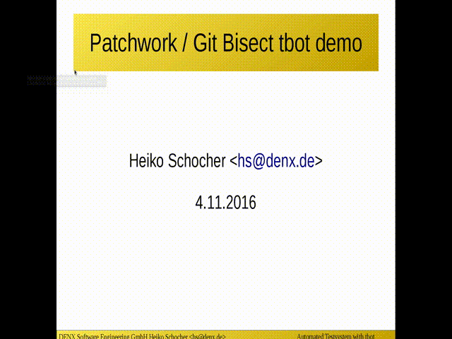

https://youtu.be/zfjpj3DLsx4

demo video for a CAN bus testcase:

https://youtu.be/hl7gI4b9CG8

demo for a buildbot integration:

http://xeidos.ddns.net/buildbot/tgrid

Contributing
============

You can submit your patches or post questions reagarding the project to the tbot Mailing List:

tbot@lists.denx.de

General information about the mailing list is at:

http://lists.denx.de/listinfo/tbot

When creating patches, please use something like:

git format-patch -s <revision range>

Please use 'git send- email' to send the generated patches to the ML to bypass changes from your mailer.

Installation
============

For a more detailed guide (with special hw), see `Guide to use tbot`.

install tbot on your PC (linux only tested):
--------------------------------------------

get the source code:
++++++++++++++++++++

::

  $ git clone https://github.com/hsdenx/tbot.git
  [...]
  $

cd into the tbot directory.

install paramiko
++++++++++++++++

you need the for running tbot the python paramiko module, see:

http://www.paramiko.org/installing.html

paramiko is used for handling ssh sessions, and open filedescriptors
on a ssh connection. Tbot open a ssh connection to a "lab PC" and
opens on that connection 2 filehandles, one for control functions
and one for the connection to the boards console. May it is worth
to think about to open more filehandles and use them in tbot, but
thats a point in the Todo list ...

See [1] for more infos about tbot principles.

create logfile directory
++++++++++++++++++++++++

prepare a directory for storing the logfiles
and pass it with the commandline option "-l"
to tbot. Default is the directory "log" in the tbot
root (don;t forget to create it, if you want to use it)

fast test
+++++++++

add the tbot :filename:`src/common` directory to your :varname:`PATH`, so tbot.py can
called from your commandline or replace :filename:`tbot.py` with :filename:`python2.7 src/common/tbot.py`
for the following example ...

Adapt in the board config file :filename:`config/tbot_test.py` the variable :varname:`connect_with_ssh_user` to
your real username on the machine where you have tbot installed.

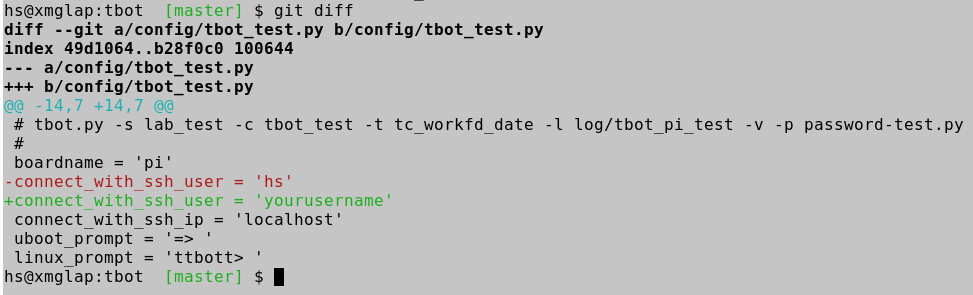

We use for this fast test the machine where we have installed
tbot also as lab PC and as board, where the (linux tests only) can
be run.

Later you can adapt the config files step by step, or move tbot to another
machine...

Adapt in :filename:`password-test.py` the password (or public key file) for your
user.

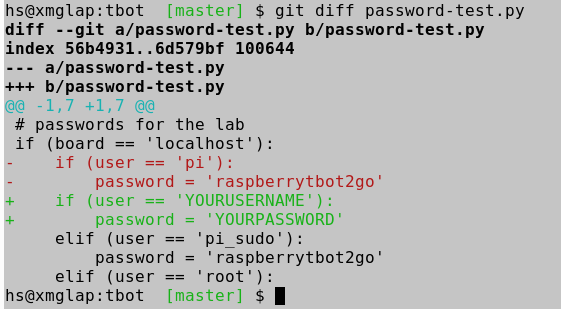

Adapt in the lab config file :filename:`config/lab_test.py` the :varname:`tc_workfd_work_dir` to
a directory which tbot can use as work directory.

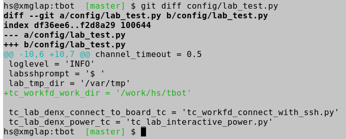

As an example testcase we use

https://github.com/hsdenx/tbot/blob/master/src/tc/linux/tc_workfd_date.py

which show for a demo how to send the linux date command in some ways,
and parse the output from the date command ...

start tbot with:

::

  tbot.py -s lab_test -c tbot_test -t tc_workfd_date -l log/tbot_pi_test -v -p password-test.py

You should see a running tbot...

Now there are 2 more steps we need:

- adapt to a boards console (serial or ssh, If you want to test bootloader you need serial)
- Power On/Off the board

Our fast test worked, because we did a linux testcase on a linux machine, and tbot
connected with ssh to the board under test ...

Console setup
+++++++++++++

As an example we connect a usb2serial adapter to our PC we play currently with tbot,
and use the kermit terminal tool. (You do not need kermit, but the tbot testcase
already exists ...)

choose kermit
.............

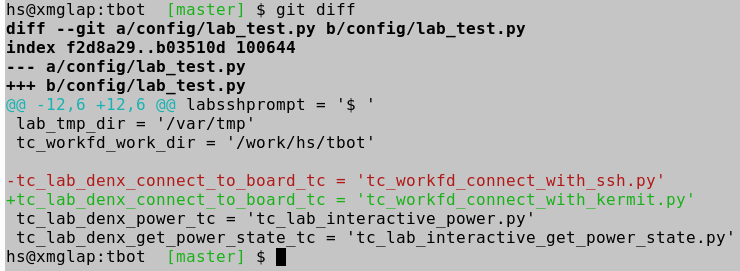

setup kermit paramters
......................

Search for your serial adapter:

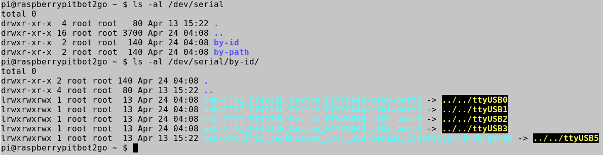

and set the serial line you will use in config/tbot_test.py.

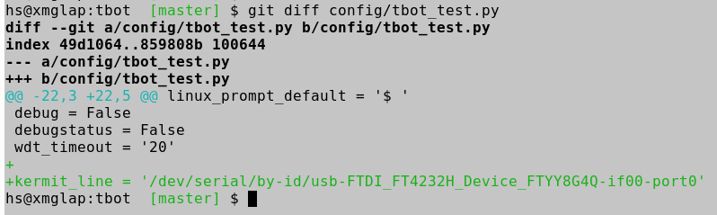

There are a lot of more possible parameters for kermit. For more
details look into the testcase:

https://github.com/hsdenx/tbot/blob/master/src/tc/linux/tc_workfd_connect_with_kermit.py

BTW: tbot_test.py is now your tbot board config file for your board, you
should rename it into a better name ... but for this installation guide
we do not rename this file (same for the lab config file lab_test.py)

Before we try to connect to the board, and say we execute a U-Boot testcase,
we must say tbot, how the U-Boot prompt from the board looks like ... default
is "=> ". !! space is needed !!

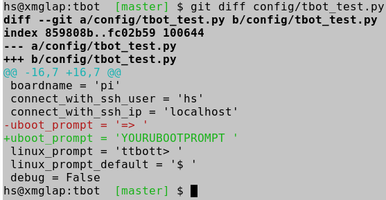

same for the linux prompt after a login:

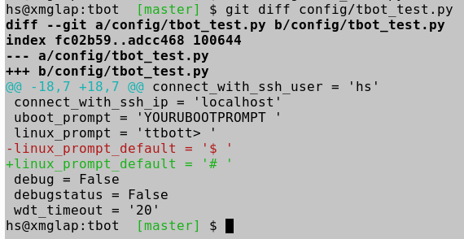

Now lets try a U-Boot testcase:

::

  tbot.py -s lab_test -c tbot_test -t tc_ub_setenv.py -l log/tbot_pi_test -v -p password-test.py

tbot should now connect with kermit to the boards console,
and try to get into U-Boot. After that, it should set
the Environmentvariable "Heiko" to the value "Schocher"

see testcase
https://github.com/hsdenx/tbot/blob/master/src/tc/uboot/tc_ub_setenv.py

The testcase uses the variables:

tb.config.setenv_name
tb.config.setenv_value

You can set them for example in the board config file:

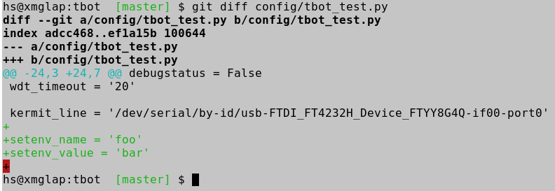

to other values (Or call this testcase from another testcase and set
this vars before calling tc_ub_setenv.py...)

(Yes I know ... it would be better to pass vars through function parameters ...)

If tbot does not find a U-Boot prompt, it tries to power off the board
and power it on ... as we do a fast setup, tbot uses for powering on/off
the "interactive" testcase:

https://github.com/hsdenx/tbot/blob/master/src/tc/lab/denx/tc_lab_interactive_power.py

which prints a countdown on the cmdline, and you must power on or off
the board ...

As we want to automate all tasks, we have to do

Power On/Off setup
++++++++++++++++++

There are a lot of ways to automate the power on/off tasks. As tbot uses
a testcase for it, you should be able to implement all cmdline based
versions ...

What we have already in tbot:

- interactive:

  https://github.com/hsdenx/tbot/blob/master/src/tc/lab/denx/tc_lab_interactive_power.py

- gpio (connect a relay to it)

  https://github.com/hsdenx/tbot/blob/master/src/tc/lab/tc_lab_power_onoff_gpio.py

- gembird power controller

  see: :ref:`adapt_gembird`

  https://github.com/hsdenx/tbot/blob/master/src/tc/lab/tc_lab_sispmctl_set_power_state.py

  https://github.com/hsdenx/tbot/blob/master/src/tc/lab/tc_lab_sispmctl_get_variables.py

  https://github.com/hsdenx/tbot/blob/master/src/tc/lab/tc_lab_sispmctl_get_power_state.py

- sainsmart usb relay

  https://www.sainsmart.com/products/4-channel-5v-usb-relay-module

  see: :ref:`tbot_switch_bootmodes`

  https://github.com/hsdenx/tbot/blob/master/src/tc/lab/tc_lab_usb_relay_power.py

  https://github.com/hsdenx/tbot/blob/master/src/tc/linux/relay/tc_linux_relay_simple_set.py

Let us decide for the sainsmart USB relay:

This needs a simple c tool, which is in tbots sourcce code
Compile simple.c from

https://github.com/hsdenx/tbot/blob/master/src/files/relay/

and install it into /usr/bin

::

  $ gcc -o simple simple.c -L. -lftd2xx -Wl,-rpath /usr/local/lib

This needs libftdi installed: http://www.ftdichip.com/Drivers/D2XX.htm

Hint: You must remove ftdio_sio module, which gets loaded when attaching the sainsmart USB relay to get simple working.

Now say tbot, to use this:

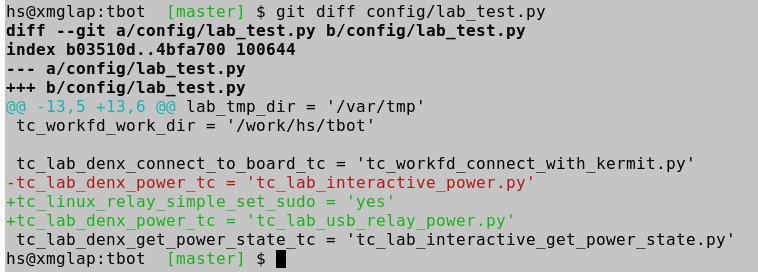

Remark: I can only use simple with "sudo", so I have to enable sudo useage for the
testcase ...

We must also define a port for our board, we do this in testcase

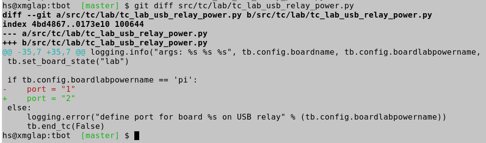

And yes, we should have this configurable through a config variable ...
send patches!

BTW: Our board has a name(currently "pi"), we set it in our board config file

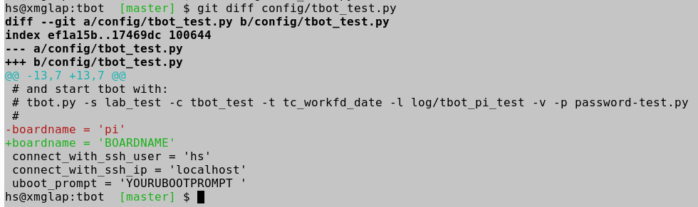

This name is used in a lot of testcases. As you can have more than
one board of the same type in your lab, but you need for example
for powering on/off a unique name, you can set for each board
a "boardlabpowername"...

Now, you are ready for using tbot and start testcases.

You should read now :ref:`guide_to_use_tbot_with_the_bbb`
as there is also described, how to setup tbot backends.

If you want a jenkins integration read:

:ref:`setup_jenkins_with_tbot`

create VLAB
+++++++++++

If your VL is not yet in tbot source, integrate it
(This task has only to be done once for your VL):

prepare a lab config file for your lab:
.......................................

special case
::::::::::::

if you own a "Gembird Silver Shield PM power controller"
and use "kermit" for accessing the serial console:

*gratulation, you are finished with setting up virtual Lab!*

use:

https://github.com/hsdenx/tbot/blob/master/config/lab_home.py

and adapt the variables:

"ip", "user", "labsshprompt", "tc_workfd_work_dir",
"lab_tmp_dir" and "tftprootdir" for your needs.

setup in:

https://github.com/hsdenx/tbot/blob/master/src/tc/lab/tc_lab_sispmctl_get_variables.py

your special settings, where tbot finds through
"tb.config.boardlabpowername" the boards settings for the
"Gembird Silver Shield PM power controller"

go to step `prepare password file`_

setup tasks
:::::::::::

* create a new folder in src/tc/lab/XXX
  replace XXX to a proper value

  Each VL needs a configuration file, passed with the option '-s' to
  tbot, example:

  https://github.com/hsdenx/tbot/blob/master/config/lab_hs_home.py

  simple copy this and rename it to

  https://github.com/hsdenx/tbot/blob/master/config/lab_XXX.py

  and adapt the settings to your specific needs.

* Then you have to setup Testcases for the 3 VL tasks:

  + Task a) power on/off board:

    default TC for this task is:

    https://github.com/hsdenx/tbot/blob/master/src/tc/lab/denx/tc_lab_denx_power.py

    now copy this file to for example

    ::

      cp src/tc/lab/denx/tc_lab_denx_power.py src/tc/lab/XXX/tc_lab_XXX_power_onoff.py

    and adapt the "remote_power" command from the denx lab to your needs.

    As this TC powers on the board for all your boards in your VL,
    you can differ between the boards through the tbot class
    variable

    ::

      tb.config.boardlabpowername

    (which is in the default case the same as "tb.config.boardname"),
    but you may need to name the power target
    with an other name than boardname, so you can configure this case.
    The power state "tb.power_state" which the TC has to set
    is "on" for power on, or "off" for power off.

    If switching on the power is successful, call "tb.end_tc(True)"
    else "tb.end_tc(False)"

    set in your lab config file:

    tc_lab_denx_power_tc = 'tc_lab_XXX_power_onoff.py'

  + Task b) get power state of a board:

    default TC for this task is:

    https://github.com/hsdenx/tbot/blob/master/src/tc/lab/denx/tc_lab_denx_get_power_state.py

    now copy this file to for example
    (replace XXX to a proper value)

    ::

      cp src/tc/lab/denx/tc_lab_denx_get_power_state.py src/tc/lab/XXX/tc_lab_XXX_get_power_state.py

    and adapt the commands to your needs.

    If the power of the board is on, call "tb.end_tc(True)"
    else "tb.end_tc(False)"

    set in your lab config file:

    tc_lab_denx_get_power_state_tc = 'tc_lab_XXX_get_power_state.py'

  + Task c) connect to the boards console:

    default TC for this task is:

    https://github.com/hsdenx/tbot/blob/master/src/tc/lab/denx/tc_lab_denx_connect_to_board.py

    now copy this file to for example

    ::

      cp src/tc/lab/denx/tc_lab_denx_connect_to_board.py src/tc/lab/XXX/tc_lab_XXX_connect_to_board.py

    and adapt the commands to your needs.

    If connect fails end this TC with "tb.end_tc(False)"
    else call "tb.end_tc(True)"

    If you want to use kermit for connecting to the boards console, you
    can use:

    https://github.com/hsdenx/tbot/blob/master/src/tc/linux/tc_workfd_connect_with_kermit.py

    Example for such a board in the VL from denx:

    tc_lab_denx_connect_to_board_tc = 'tc_workfd_connect_with_kermit.py'

    https://github.com/hsdenx/tbot/blob/master/config/tbot_dxr2.cfg#L20

    set in your lab config file:

    tc_lab_denx_connect_to_board_tc = 'tc_lab_XXX_connect_to_board.py'

prepare password file
+++++++++++++++++++++

This file contains all passwords tbot needs (for example for
linux login on the boards)
tbot searches this file in the tbot root directory.
It is a simple python file, for example:

::

  # passwords for the lab
  if (board == 'labip'):
      if (user == 'hs'):
          password = 'passwordforuserhs'
      if (user == 'root'):
          password = 'passwordforrootuser'
  elif (board == 'lab_withpublickey'):
      if (user == 'usernamelab'):
          password = 'key:<path_to_publickeyfile>'
  # passwords for the boards
  elif (board == 'mcx'):
      if (user == 'root'):
          password = 'passwordformcxrootfs'
  else:
      if (user == 'root'):
          password = ''

tbot searches in the root folder for this file.

It contains also the password for logging into your
vlab. If you log into your vlab with username/password,
see example 'labip'

If you want to use a public key for logging into your
vlab, see example 'lab_withpublickey'

prepare board config file
+++++++++++++++++++++++++

Each board which is found in the VL needs a tbot configuration file
pass the config file name with the option '-c' to tbot, tbot searches
in the "config" folder for them.

board Example (dxr2 board):
https://github.com/hsdenx/tbot/blob/master/config/dxr2.py

The board config file contains TC specific settings, which are
dependend on the board you want to test.

tbot parses first the board config file, than the lab config file
and at last default settings for TC variables, which are
set in

https://github.com/hsdenx/tbot/blob/master/src/common/default.py

If a variable is already set, its value is not overwritten.

You may need to overwrite board config variables for different
labs, so you can define in the lab config file the function:

::

  def set_labspecific(tb)

in which you can overwrite tb.config settings dependend on

tb.config.boardname or tb.config.boardlapowername

Thats it ... you now can call tbot and hopefully, it works ;-)

If you have problems in settings up tbot, please contact me
(and may give me ssh access to your Lab PC ;-)

Heiko Schocher <hs@denx.de>
v2 2016.11.02
