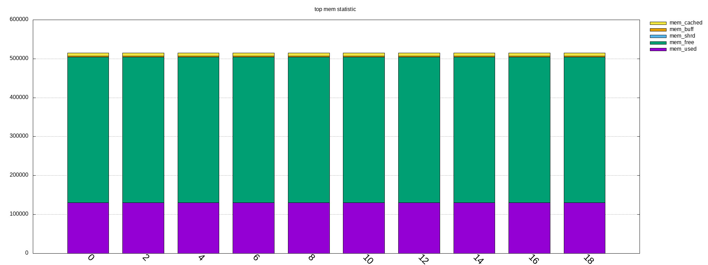

====
Tips
====

tbot Tips/Tricks/Hints
======================

This section collect Tips/Tricks/hints for tbot usage.

more readable verbose output
----------------------------

tbot prints as fast the incoming characters in verbose mode as possible.

This leads in more or less unreadable verbose output, if you want to
follow what tbot does ... So add the following patch:

::

  hs@localhost:tbot  [master] $ git diff
  diff --git a/src/common/tbot_connection_paramiko.py b/src/common/tbot_connection_paramiko.py
  index b5bdd33..423d8f6 100644
  --- a/src/common/tbot_connection_paramiko.py
  +++ b/src/common/tbot_connection_paramiko.py
  @@ -7,6 +7,7 @@ import logging
   import paramiko
   import socket
   import traceback
  +from time import sleep
   
   class Connection(object):
     """ The connection class
  @@ -83,6 +84,7 @@ class Connection(object):
           """ get bytes from connection
           """
           try:
  +            sleep(0.2)
               tmp = self.channel.recv(self.maxread)
           except socket.timeout:
               logging.debug("read_bytes: Timeout")
  hs@localhost:tbot  [master] $

!! This slows down tbot !! Do not use it in "normal" test environment.

usb serial adapter fix device names
-----------------------------------

If you have more than one serial adapter you have the problem, that the
ttyUSB* device names change from boot to boot ...

To solve this problem use a udev rule.

Check the Vendor/Product ID with lsusb:

::

  [root@localhost]# lsusb
  Bus 003 Device 002: ID 8087:8000 Intel Corp. 
  Bus 003 Device 001: ID 1d6b:0002 Linux Foundation 2.0 root hub
  Bus 002 Device 001: ID 1d6b:0003 Linux Foundation 3.0 root hub
  Bus 001 Device 004: ID 1bcf:2c6e Sunplus Innovation Technology Inc. 
  Bus 001 Device 005: ID 0489:e078 Foxconn / Hon Hai 
  Bus 001 Device 014: ID 0403:6001 Future Technology Devices International, Ltd FT232 USB-Serial (UART) IC
  Bus 001 Device 009: ID 04b4:fd13 Cypress Semiconductor Corp. Programmable power socket
  Bus 001 Device 015: ID 067b:2303 Prolific Technology, Inc. PL2303 Serial Port
  Bus 001 Device 007: ID 05e3:0610 Genesys Logic, Inc. 4-port hub
  Bus 001 Device 006: ID 046d:c52b Logitech, Inc. Unifying Receiver
  Bus 001 Device 001: ID 1d6b:0002 Linux Foundation 2.0 root hub
  [root@localhost]# 

The serial adapter in my system has the Vendor/Product ID "067b:2303".

For distingushing between more than one adapter, we need an unique number
for each adapter ... hopefully your adapters have such a number, in my
example I use the serial number.

read the number for each /dev/ttyUSB* device with the help of the udevadm cmd:

::

  [root@localhost]# udevadm info -a -n /dev/ttyUSB1 | grep '{serial}' | head -n1
      ATTRS{serial}=="A6008isP"
  [root@localhost]# 

Now we can create an udev rules for it, so each serial dapter can get his
own device.

create a "/etc/udev/rules.d/99-usb-serial.rules" and put the follwoing line there:

::

  SUBSYSTEM=="tty", ATTRS{idVendor}=="067b", ATTRS{idProduct}=="2303", ATTRS{serial}=="A6008isP", SYMLINK+="ttybbb"

Test the new rule with

::

  $ udevadm test $(udevadm info -q path -n /dev/ttyUSB1) 2>&1

You should see now a new device "/dev/ttybbb" ...

More to udev rules:

https://wiki.archlinux.org/index.php/udev

top analysis
------------

log in to a board with ssh and start the "top" command and
analyse the output of it and generate a textfile gnuplot understands.

constraints
-----------

Linux is running on the board for which you want to analyse top output,
and you can access it through ssh. Of course the "top" command must
be availiable.

use for connecting to boars console the ssh testcase:

::

  -tc_lab_denx_connect_to_board_tc = 'tc_workfd_connect_with_kermit.py'
  +tc_lab_denx_connect_to_board_tc = 'tc_workfd_connect_with_ssh.py'

and start the top testcase, for example for the BBB board:

::

  tbot.py -s lab_tbot2go-ssh -c beagleboneblack -t tc_linux_top.py -l log/tbot_linux_top.log -v

This creates the gnuplot input file "top-stat.dat".

You can now call gnuplt to convert it into an image with the
gnuplot config file "src/files/top_plot_mem.sem"

::

  gnuplot src/files/top_plot_mem.sem

example
-------

